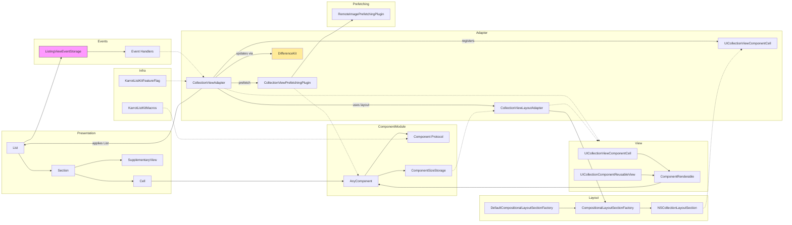

# KarrotListKit — Architecture Overview and Guide ✅

**짧은 소개**
KarrotListKit는 UIKit 기반의 선언적 목록(리스트) UI 프레임워크입니다. Component 기반 API를 통해 `UICollectionView`를 추상화하고, `DifferenceKit`을 이용한 고성능 diff/배치 업데이트, 컴포넌트 재사용, 레이아웃 추상화, 프리페칭 플러그인, 이벤트/페이징 지원 등을 제공합니다.

---

## 핵심 개념 🔧

- **Component**: 화면에 그려지는 최소 단위. View와 ViewModel을 캡슐화하고 `renderContent`, `render(in:)` 등을 제공.
- **List / Section / Cell**: 화면 표현 계층. `List` -> `Section` -> `Cell` 구조.
- **CollectionViewAdapter**: `UICollectionView`와 KarrotListKit 모델을 연결(어댑터). Diff 적용, 등록, 프리페칭, 이벤트 전달 담당.
- **Layout Adapter**: `UICollectionViewCompositionalLayout`와 연결해 섹션 레이아웃을 제공.
- **Prefetching Plugin**: 리소스(예: 원격 이미지) 프리페칭을 모듈화해 성능 개선.
- **Events**: 스크롤, 선택, willDisplay 등 다양한 이벤트를 `ListingViewEventStorage`로 등록하여 처리.
- **Feature Flags & Macros**: 기능 플래그와 컴파일 타임 매크로(예: AddComponentModifier) 지원.

---

## 아키텍처 다이어그램 (Mermaid) 🗺️



> 위 차트는 주요 모듈(프레젠테이션, 컴포넌트, 어댑터, 뷰, 레이아웃, 프리페칭, 이벤트, 인프라)과 그 상호작용을 요약한 것입니다.

---

## 모듈별 상세 설명 🧩

### Presentation (List / Section / Cell)
- `List`는 전체 컬렉션 구조를 표현합니다. `SectionsBuilder`를 통해 선언적으로 구성할 수 있습니다.
- `Section`은 `cells`, `header`, `footer`, 그리고 섹션별 레이아웃을 가지고 있습니다.
- `Cell`은 `AnyComponent`를 보유해 재사용 가능한 컴포넌트로 렌더링됩니다.

### Component
- `Component` 프로토콜은 `ViewModel`, `Content(UIView)`, `Coordinator` 등을 정의합니다.
- 컴포넌트는 `renderContent`, `render(in:)`, `layout(content:in:)`를 구현하여 UIKit과 연결됩니다.
- `AnyComponent`로 타입 소거하여 `Cell` / `SupplementaryView`에서 사용합니다.

### Adapter
- `CollectionViewAdapter`가 핵심이며, `apply(_:updateStrategy:completion:)`로 `List`를 적용합니다.
- 내부적으로 `DifferenceKit`의 `StagedChangeset`과 커스텀 `UICollectionView.reload(using:)`를 통해 효율적으로 업데이트합니다.
- `CollectionViewLayoutAdapter`는 레이아웃 책임을 분리해 `UICollectionViewCompositionalLayout`의 섹션을 제공합니다.

### View
- `UICollectionViewComponentCell`과 `UICollectionComponentReusableView`는 `ComponentRenderable`을 채택하여 컴포넌트를 실제 뷰로 렌더링합니다.
- 셀의 크기는 `sizeThatFits`와 `preferredLayoutAttributesFitting`으로 결정되고, `ComponentSizeStorage`에 캐시될 수 있습니다.

### Prefetching
- `CollectionViewAdapter`는 `UICollectionViewDataSourcePrefetching`을 구현합니다.
- 플러그인 형태로 `RemoteImagePrefetchingPlugin` 같은 프리페처를 주입하여 확장할 수 있습니다.

### Events
- `ListingViewEventStorage`에 스크롤, 선택, willDisplay 등 이벤트 핸들러를 저장하고 어댑터를 통해 트리거됩니다.
- `List`, `Section`, `Cell`에서 체이닝 방식으로 이벤트를 등록 가능합니다.

### Feature Flags, Macros, Tests
- `KarrotListKitFeatureFlag`를 통해 런타임 플래그를 지원합니다.
- `KarrotListKitMacros`와 `AddComponentModifierMacro`로 컴포넌트 빌더 확장을 지원합니다.
- 테스트는 `Tests/`에 유닛 테스트들이 존재하며 주요 컴포넌트/어댑터/레이아웃을 검증합니다.

---

## 빠른 시작 예시 ✨

```swift
let collectionView = UICollectionView(frame: .zero,
  collectionViewLayout: UICollectionViewCompositionalLayout(
    sectionProvider: layoutAdapter.sectionLayout
  )
)

let adapter = CollectionViewAdapter(
  configuration: .init(),
  collectionView: collectionView,
  layoutAdapter: CollectionViewLayoutAdapter()
)

let list = List {
  Section(id: "s1") {
    Cell(id: "c1", component: ButtonComponent(viewModel: .init(title: "Hi")))
  }
}

adapter.apply(list)
```

---

## 파일 위치 빠른 참조
- 주요 소스: `Sources/KarrotListKit/`
  - `Adapter/` — 어댑터 및 레이아웃 어댑터
  - `Component/` — 컴포넌트 정의, AnyComponent
  - `View/` — 셀/재사용 뷰 및 렌더러
  - `Layout/` — Compositional layout factories
  - `Prefetching/` — 프리페칭 인터페이스 및 플러그인
  - `Event/` — 이벤트 정의 및 스토리지
  - `FeatureFlag/`, `MacroInterface/`, `Utils/`
- 예제 앱: `Examples/KarrotListKitSampleApp`
- 테스트: `Tests/`

---

## 개발/테스트 팁 💡
- 변경 시 `CollectionViewAdapter`의 업데이트 로직(DifferenceKit + reload(using:)) 테스트를 확인하세요.
- 새로운 컴포넌트를 추가할 때는 `reuseIdentifier`, `layoutMode`와 `sizeThatFits` 동작을 검증하세요.
- 프리페칭 플러그인을 추가하면 `UICollectionViewDataSourcePrefetching` 동작을 통해 취소/완료를 테스트하세요.

---

## 라이선스
이 프로젝트는 Apache 2.0 라이선스입니다. 자세한 내용은 `LICENSE`를 확인하세요.

---

필요하시면 이 파일을 더 기술 문서 형식(예: 도메인별 다이어그램, 클래스 다이어그램, 심화 예제)으로 확장해 드리겠습니다. 🔧