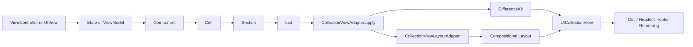
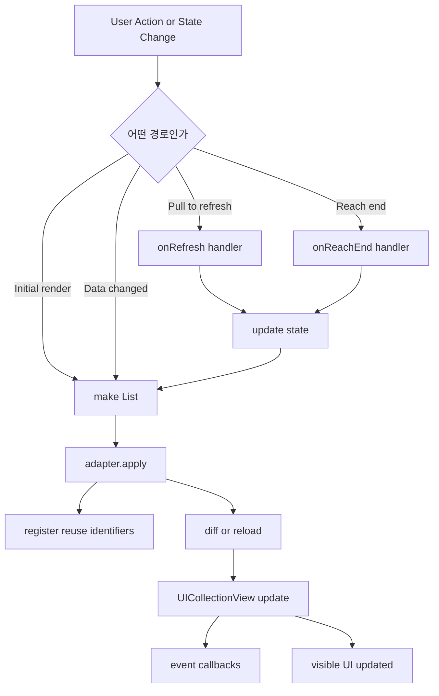

# TurboListKit

`TurboListKit`은 `UICollectionView`를 `Component -> Cell -> Section -> List` 구조로 선언형에 가깝게 구성할 수 있게 도와주는 UIKit 리스트 어댑터입니다.

DifferenceKit 기반 diff 업데이트, compositional layout 연결, 이벤트 modifier, prefetching plugin 구성을 한 곳에 묶어 `UICollectionView` 보일러플레이트를 줄이는 것이 목적입니다.

## 목차

- [목적](#목적)
- [사용법](#사용법)
- [오토레이아웃 컴포넌트](#오토레이아웃-컴포넌트)
- [핵심 타입](#핵심-타입)
- [기능](#기능)
- [예제 앱](#예제-앱)
- [성능 비교](#성능-비교)
- [전체 파이프라인](#전체-파이프라인)
- [동작 파이프라인](#동작-파이프라인)

## 목적

- `UICollectionViewDataSource`, `UICollectionViewDelegate`, 셀 등록, diff 계산, 이벤트 라우팅을 adapter 내부로 캡슐화합니다.
- `List`, `Section`, `Cell`, `Component` 조합으로 화면 구조를 데이터처럼 표현합니다.
- 섹션 단위 compositional layout을 붙여 세로 리스트, 가로 리스트, 그리드 같은 레이아웃을 섞어 구성할 수 있게 합니다.
- `didSelect`, `onRefresh`, `onReachEnd` 같은 이벤트를 modifier 스타일로 선언할 수 있게 합니다.
- 필요 시 prefetching plugin을 연결해 리소스 로딩 성능을 보완할 수 있게 합니다.

## 사용법

### 1. Adapter 준비

```swift
import TurboListKit
import UIKit

private let layoutAdapter = CollectionViewLayoutAdapter()

private lazy var collectionView: UICollectionView = {
    let layout = UICollectionViewCompositionalLayout { [weak self] index, environment in
        self?.layoutAdapter.sectionLayout(index: index, enviroment: environment)
    }

    return UICollectionView(frame: .zero, collectionViewLayout: layout)
}()

private lazy var adapter = CollectionViewAdapter(
    configuration: .init(
        refreshControl: .enabled(tintColor: .systemBlue)
    ),
    collectionView: collectionView,
    layoutAdapter: layoutAdapter
)
```

### 2. List 구성

```swift
let list = List {
    Section(id: "feed") {
        for item in items {
            Cell(
                id: item.id,
                component: FeedItemComponent(viewModel: item)
            )
            .didSelect { context in
                print("selected:", context.id)
            }
        }
    }
    .withHeader(FeedHeaderComponent(title: "Feed"))
    .withSectionLayout(
        DefaultCompositionalLayoutSectionFactory.vertical(spacing: 12)
            .withSectionContentInsets(.init(top: 16, leading: 20, bottom: 16, trailing: 20))
    )
}
.onRefresh { [weak self] _ in
    self?.reloadItems()
}
.onReachEnd(offsetFromEnd: .relativeToContainerSize(multiplier: 1.0)) { [weak self] _ in
    self?.loadNextPage()
}
```

### 3. 화면 반영

```swift
adapter.apply(
    list,
    updateStrategy: .animatedBatchUpdates
)
```

### 4. 상태 변경 후 다시 apply

```swift
func render() {
    adapter.apply(makeList())
}
```

`TurboListKit`은 상태를 직접 보관하지 않으므로, 데이터가 바뀌면 새 `List`를 다시 만들어 `apply(...)`하는 방식으로 갱신합니다.

## 오토레이아웃 컴포넌트

오토레이아웃으로 구성한 `UIView`도 `TurboListKit` 컴포넌트로 그대로 사용할 수 있습니다. 이 경우 핵심은 `sizeThatFits(_:)`에서 오토레이아웃이 계산한 크기를 반환하는 것입니다.

`DemoApp` 예제에는 공통 헬퍼 [`UIView+AutoLayoutFittingSize.swift`](./Examples/DemoApp/DemoApp/UIView+AutoLayoutFittingSize.swift)가 포함되어 있습니다.

```swift
override func sizeThatFits(_ size: CGSize) -> CGSize {
    autoLayoutFittingSize(for: size)
}
```

- 너비가 이미 정해져 있고, 오토레이아웃이 계산한 실제 높이를 알아야 할 때
- `systemLayoutSizeFitting(...)` 호출을 공통 헬퍼로 감싸서 여러 컴포넌트에서 같은 `sizeThatFits(_:)` 패턴을 재사용할 수 있습니다.
<br>

```swift
override func sizeThatFits(_ size: CGSize) -> CGSize {
    autoLayoutFittingSize(
        for: size,
        targetWidth: min(size.width, 240),
        minimumHeight: 140
    )
}
```

- 폭 상한이나 최소 높이가 필요한 카드형 컴포넌트일 때
- 카드가 너무 넓어지지 않게 최대 폭을 제한하고 싶을 때 사용합니다.
- 오토레이아웃 결과보다 작은 높이가 나오면 안 되는 UI에서 최소 높이를 함께 보장할 수 있습니다.
<br>

```swift
override func sizeThatFits(_ size: CGSize) -> CGSize {
    let labelSize = label.sizeThatFits(
        CGSize(width: CGFloat.greatestFiniteMagnitude, height: 24)
    )
    return CGSize(width: labelSize.width + 28, height: 48)
}
```

- 높이는 고정이고, 텍스트 길이에 따라 폭이 달라지는 pill/tag 컴포넌트일 때
- 높이는 고정이고 폭만 내용에 따라 달라지는 경우라면 오토레이아웃 헬퍼보다 직접 계산이 더 단순합니다.
- pill, chip, tag처럼 한 줄 텍스트와 좌우 패딩만으로 크기가 결정되는 컴포넌트에 잘 맞습니다.
<br>

## 핵심 타입

| 타입 | 역할 | 주로 언제 쓰는가 |
| --- | --- | --- |
| `Component` | 셀/보조뷰를 그리는 최소 단위 | 실제 UI와 view model을 묶을 때 |
| `AnyComponent` | `Component` 타입 소거 래퍼 | 내부 저장 및 diff 비교 시 |
| `IdentifiableComponent` | `id`를 가진 `Component` | `Cell(component:)` 형태로 간단히 만들 때 |
| `Cell` | 컬렉션 뷰 셀 모델 | 아이템 단위 UI를 선언할 때 |
| `Section` | 셀 배열 + header/footer + layout 모델 | 섹션 단위 구성과 레이아웃을 묶을 때 |
| `SupplementaryView` | header/footer 표현 모델 | 섹션 보조 뷰를 붙일 때 |
| `List` | 화면 전체 리스트 모델 | 여러 섹션과 리스트 이벤트를 묶을 때 |
| `CollectionViewAdapter` | `UICollectionView`와 `List`를 연결하는 핵심 어댑터 | 실제 화면에 리스트를 반영할 때 |
| `CollectionViewAdapterConfiguration` | adapter 동작 옵션 | refresh, 커스텀 인디케이터, batch update, reconfigure 옵션을 설정할 때 |
| `CollectionViewAdapterUpdateStrategy` | 업데이트 방식 enum | animated batch, non-animated batch, reloadData를 고를 때 |
| `CollectionViewLayoutAdapter` | compositional layout과 section 데이터를 연결 | `UICollectionViewCompositionalLayout`의 section provider를 붙일 때 |
| `CompositionalLayoutSectionFactory` | 섹션 레이아웃 생성 프로토콜 | 커스텀 `NSCollectionLayoutSection`을 만들 때 |
| `DefaultCompositionalLayoutSectionFactory` | 기본 제공 레이아웃 팩토리 | 빠르게 vertical/horizontal/grid 레이아웃을 붙일 때 |
| `VerticalLayout` | 세로 리스트 레이아웃 팩토리 | 일반 피드/리스트 섹션 구성 시 |
| `HorizontalLayout` | 가로 스크롤 레이아웃 팩토리 | 카드 캐러셀 구성 시 |
| `VerticalGridLayout` | 그리드 레이아웃 팩토리 | 2열 이상 그리드 구성 시 |
| `CollectionViewPrefetchingPlugin` | prefetch 확장 포인트 | 이미지 등 리소스 prefetch를 붙일 때 |
| `ComponentRemoteImagePrefetchable` | 원격 이미지 prefetch 대상 프로토콜 | 컴포넌트가 미리 받아둘 URL을 제공할 때 |

## 기능

### Modifier / Event 기능

| 대상 | API | 설명 |
| --- | --- | --- |
| `List` | `didScroll` | 스크롤 중 이벤트를 받습니다. |
| `List` | `onRefresh` | pull-to-refresh 이벤트를 받습니다. |
| `List` | `onReachEnd` | 리스트 끝 근처 도달 시 추가 로딩 이벤트를 받습니다. |
| `List` | `willBeginDragging` | 드래그 시작 직전 이벤트를 받습니다. |
| `List` | `willEndDragging` | 드래그 종료 직전 이벤트를 받습니다. |
| `List` | `didEndDragging` | 드래그 종료 이벤트를 받습니다. |
| `List` | `didScrollToTop` | 맨 위로 이동했을 때 이벤트를 받습니다. |
| `List` | `willBeginDecelerating` | 감속 시작 이벤트를 받습니다. |
| `List` | `didEndDecelerating` | 감속 종료 이벤트를 받습니다. |
| `List` | `shouldScrollToTop` | 탭 시 상단 이동 허용 여부를 제어합니다. |
| `Section` | `withSectionLayout` | 섹션 레이아웃을 지정합니다. |
| `Section` | `withHeader` | 섹션 헤더를 붙입니다. |
| `Section` | `withFooter` | 섹션 푸터를 붙입니다. |
| `Section` | `willDisplayHeader` | 헤더 표시 직전 이벤트를 받습니다. |
| `Section` | `willDisplayFooter` | 푸터 표시 직전 이벤트를 받습니다. |
| `Section` | `didEndDisplayHeader` | 헤더 제거 이벤트를 받습니다. |
| `Section` | `didEndDisplayFooter` | 푸터 제거 이벤트를 받습니다. |
| `Cell` | `didSelect` | 셀 선택 이벤트를 받습니다. |
| `Cell` | `willDisplay` | 셀 표시 직전 이벤트를 받습니다. |
| `Cell` | `didEndDisplay` | 셀 제거 이벤트를 받습니다. |
| `Cell` | `onHighlight` | 셀 눌림 상태 이벤트를 받습니다. |
| `Cell` | `onUnhighlight` | 셀 눌림 해제 이벤트를 받습니다. |
| `SupplementaryView` | `willDisplay` | 보조 뷰 표시 직전 이벤트를 받습니다. |
| `SupplementaryView` | `didEndDisplaying` | 보조 뷰 제거 이벤트를 받습니다. |

### Adapter / Update 기능

| 기능 | API | 설명 |
| --- | --- | --- |
| 데이터 반영 | `apply(_:updateStrategy:completion:)` | 새 `List`를 `UICollectionView`에 반영합니다. |
| 현재 상태 조회 | `snapshot()` | 현재 adapter가 보유한 `List` 스냅샷을 반환합니다. |
| animated diff update | `.animatedBatchUpdates` | DifferenceKit 기반 애니메이션 갱신을 수행합니다. |
| non-animated diff update | `.nonanimatedBatchUpdates` | 애니메이션 없이 변경분만 갱신합니다. |
| full reload | `.reloadData` | 전체 `reloadData()`를 수행합니다. |
| refresh control | `CollectionViewAdapterConfiguration.RefreshControl` | 시스템 `UIRefreshControl` 연결 여부와 tint를 설정합니다. |
| custom refresh indicator | `CollectionViewAdapterConfiguration.RefreshControl.Appearance` | 기본 스피너 대신 커스텀 이미지 인디케이터 표시 방식을 설정합니다. |
| queued update | adapter 내부 큐 | 업데이트 중 들어온 새 요청을 마지막 요청 기준으로 이어서 처리합니다. |
| reconfigure items | `enablesReconfigureItems` | 가능하면 셀 재생성 대신 reconfigure 경로를 사용합니다. |
| prefetching plugin | `CollectionViewPrefetchingPlugin` | prefetch lifecycle을 확장합니다. |

### Custom Refresh Indicator

| 대상 | API | 설명 |
| --- | --- | --- |
| 인디케이터 활성화 | `refreshControlAppearance: .init(...)` | refresh control 위에 커스텀 인디케이터 외형을 연결합니다. |
| 기본 이미지 지정 | `Indicator.image(_:)` | 커스텀 인디케이터로 사용할 이미지를 지정합니다. |
| 크기 조절 | `.size(_:)` | 이미지 렌더링 크기를 포인트 단위로 설정합니다. |
| 색상 적용 | `.tintColor(_:)` | 템플릿 렌더링용 tint color를 적용합니다. |
| 회전 애니메이션 | `.spin(duration:)` | 지정한 duration으로 인디케이터 회전 애니메이션을 적용합니다. |

## 예제 앱

[`Examples/DemoApp`](./Examples/DemoApp)에는 현재 다음 UIKit 예제가 포함되어 있습니다.

- `DemoViewController`: 세로/가로/그리드 섹션, refresh, reach-end, selection을 한 화면에서 보여주는 종합 예제
- `SampleViewController`: 가장 단순한 세로 리스트 예제
- `SampleAutoLayoutViewController`: `SampleViewController`를 오토레이아웃 아이템 컴포넌트로 옮긴 버전
- `AutoLayoutSampleViewController`: `UIStackView`와 제약만으로 셀 높이를 계산하는 오토레이아웃 예제
- `HorizontalOnlyViewController`: 가로 카드 페이징과 연속 가로 태그 섹션만 모아둔 예제

예제 앱 상세 설명은 [`Examples/DemoApp/README.md`](./Examples/DemoApp/README.md)에서 볼 수 있습니다.

## 성능 비교

`TurboListKit`은 기본 diff 엔진으로 `UICollectionViewDiffableDataSource` 대신 `DifferenceKit`을 사용합니다. Apple의 diffable data source도 섹션과 아이템 업데이트를 지원하지만, `TurboListKit`은 diff 계산 결과와 batch update fallback 정책을 adapter에서 직접 제어하기 위해 `DifferenceKit`을 선택했습니다.

### 왜 `DifferenceKit`을 선택했는가

| 비교 항목 | `DifferenceKit` | `UICollectionViewDiffableDataSource` |
| --- | --- | --- |
| 핵심 접근 | 직접 diff를 계산해 staged batch update에 반영 | snapshot을 적용하고 내부 diff를 시스템에 위임 |
| 알고리즘 근거 | Paul Heckel 기반, 선형 시간 `O(n)` diff를 명시 | Apple 문서가 단순성, identifier 기반 업데이트를 강조 |
| 섹션 지원 | 2차원 sectioned collection diff를 직접 모델링 | snapshot 중심 API로 추상화 |
| 업데이트 제어 | change 수가 많을 때 `reloadData` fallback 같은 정책을 세밀하게 제어 가능 | apply 시점 제어는 쉽지만 내부 diff 전략은 추상화되어 있음 |
| 채택 이유 | 라이브러리 레벨에서 성능 특성과 업데이트 전략을 노출하기 쉬움 | 앱 코드 단순화에는 강점이 있지만 adapter 내부 diff 제어 범위는 좁음 |

### 시간 복잡도 근거

- `DifferenceKit` 공식 README는 Paul Heckel 기반 diff 알고리즘이며, 선형 시간 `O(n)`으로 동작한다고 명시합니다.
- 같은 비교 표에서 `Swift.CollectionDifference`는 Myers 기반 `O(ND)`로 소개됩니다.
- Apple의 diffable data source 문서는 내부 복잡도를 전면에 내세우기보다, snapshot과 stable identifier를 사용해 컬렉션 변경을 단순화하는 점에 초점을 둡니다.

### 벤치마크 근거

`DifferenceKit` 공식 벤치마크에는 `Swift.CollectionDifference`와의 비교가 포함되어 있습니다.

| 시나리오 | `DifferenceKit` | `Swift.CollectionDifference` |
| --- | --- | --- |
| 5,000개 원소, 1,000 delete, 1,000 insert, 200 shuffle | `0.0019s` | `0.0620s` |
| 100,000개 원소, 10,000 delete, 10,000 insert, 2,000 shuffle | `0.0348s` | `5.0281s` |

이 수치는 `DifferenceKit` 저장소에서 공개한 벤치마크 결과이며, `TurboListKit` 자체 벤치마크는 아닙니다. 다만 adapter가 large diff를 다루는 상황에서 어떤 diff 엔진을 기반으로 삼았는지 설명하는 근거로는 충분합니다.

### 참고 자료

- [Apple, Updating collection views using diffable data sources](https://developer.apple.com/documentation/uikit/updating-collection-views-using-diffable-data-sources): stable identifier와 snapshot 기반 업데이트 설명
- [DifferenceKit README](https://github.com/ra1028/DifferenceKit): `O(n)` 알고리즘 설명, `Swift.CollectionDifference` 포함 벤치마크 공개

## 전체 파이프라인



## 동작 파이프라인


